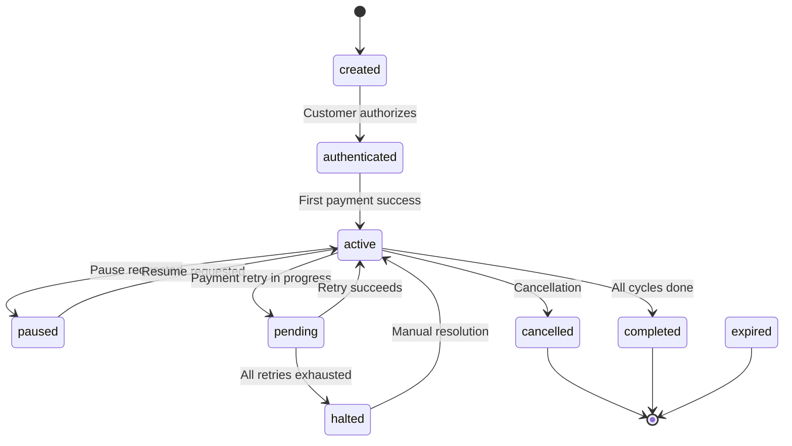

# better-auth-razorpay(Community Plugin)

A comprehensive [Razorpay](https://razorpay.com) plugin for [Better Auth](https://better-auth.com) — subscriptions, customers, plans, webhooks, and organization billing out of the box.

---

## Features

- 🔄 **Subscription lifecycle** — create, upgrade, cancel, pause, resume, update
- 👤 **Customer sync** — auto-create Razorpay customers on sign-up, keep email/name in sync
- 🏢 **Organization billing** — per-org subscriptions with seat-based quantity sync
- 🔔 **Webhook handling** — HMAC-SHA256 verified webhook processing for all subscription events
- 📋 **Plan management** — create, list, and fetch Razorpay plans via API
- 🧾 **Invoices & offers** — fetch invoices, link/unlink offers to subscriptions
- 🔒 **Type-safe** — full TypeScript support with typed error codes and status helpers

---

## Installation

```bash
npm install better-auth-razorpay razorpay
```

## Quick Start

### 1. Server Setup

```ts
import { betterAuth } from "better-auth";
import { razorpay } from "better-auth-razorpay";
import Razorpay from "razorpay";

const razorpayClient = new Razorpay({
  key_id: process.env.RAZORPAY_KEY_ID!,
  key_secret: process.env.RAZORPAY_KEY_SECRET!,
});

export const auth = betterAuth({
  plugins: [
    razorpay({
      razorpayClient,
      razorpayWebhookSecret: process.env.RAZORPAY_WEBHOOK_SECRET!,
      createCustomerOnSignUp: true,

      subscription: {
        enabled: true,
        plans: [
          {
            planId: "plan_XXXXXXXXXX",
            name: "pro",
            totalCount: 12,
          },
          {
            planId: "plan_YYYYYYYYYY",
            annualPlanId: "plan_ZZZZZZZZZZ",
            name: "enterprise",
            totalCount: 1,
            quantity: 1, // seat-based
          },
        ],

        onSubscriptionActivated: async ({ subscription, plan, event }) => {
          console.log(`Subscription activated: ${subscription.id}`);
        },
      },
    }),
  ],
});
```

### 2. Client Setup

```ts
import { createAuthClient } from "better-auth/client";
import { razorpayClient } from "better-auth-razorpay/client";

export const client = createAuthClient({
  plugins: [
    razorpayClient({
      subscription: true,
    }),
  ],
});
```

### 3. Webhook Endpoint

Register your webhook URL in the [Razorpay Dashboard](https://dashboard.razorpay.com/app/webhooks):

```
https://your-domain.com/api/auth/razorpay/webhook
```

Select the following events:

- `subscription.authenticated`
- `subscription.activated`
- `subscription.charged`
- `subscription.pending`
- `subscription.halted`
- `subscription.cancelled`
- `subscription.completed`
- `subscription.paused`
- `subscription.resumed`
- `subscription.updated`

---

## Configuration

### `RazorpayOptions`

| Option                    | Type                  | Required | Description                                         |
| ------------------------- | --------------------- | -------- | --------------------------------------------------- |
| `razorpayClient`          | `Razorpay`            | ✅       | Razorpay SDK instance                               |
| `razorpayWebhookSecret`   | `string`              | ✅       | Webhook secret for HMAC-SHA256 verification         |
| `createCustomerOnSignUp`  | `boolean`             | ❌       | Auto-create Razorpay customer when a user registers |
| `onCustomerCreate`        | `function`            | ❌       | Callback after customer creation                    |
| `getCustomerCreateParams` | `function`            | ❌       | Customize Razorpay customer creation params         |
| `subscription`            | `SubscriptionOptions` | ❌       | Subscription configuration (see below)              |
| `organization`            | `OrganizationOptions` | ❌       | Organization billing configuration (see below)      |
| `onEvent`                 | `function`            | ❌       | Callback for all incoming webhook events            |
| `schema`                  | `object`              | ❌       | Custom schema overrides                             |

### `SubscriptionOptions`

Enable subscriptions by setting `subscription.enabled: true`:

```ts
subscription: {
  enabled: true,
  plans: [...],

  // Optional settings
  requireEmailVerification: false,
  authorizeReference: async ({ user, referenceId, action }) => true,
  getSubscriptionCreateParams: async ({ user, plan }) => ({}),

  // Lifecycle callbacks
  onSubscriptionActivated: async ({ event, razorpaySubscription, subscription, plan }) => {},
  onSubscriptionAuthenticated: async ({ event, razorpaySubscription, subscription }) => {},
  onSubscriptionCharged: async ({ event, razorpaySubscription, subscription }) => {},
  onSubscriptionCancelled: async ({ event, razorpaySubscription, subscription }) => {},
  onSubscriptionPaused: async ({ event, razorpaySubscription, subscription }) => {},
  onSubscriptionResumed: async ({ event, razorpaySubscription, subscription }) => {},
  onSubscriptionHalted: async ({ event, razorpaySubscription, subscription }) => {},
  onSubscriptionPending: async ({ event, razorpaySubscription, subscription }) => {},
  onSubscriptionCompleted: async ({ event, razorpaySubscription, subscription }) => {},
  onSubscriptionUpdated: async ({ event, razorpaySubscription, subscription }) => {},
}
```

### Plan Configuration

```ts
type RazorpayPlan = {
  planId: string; // Razorpay plan ID (e.g., "plan_XXXXXXXXXX")
  name: string; // Plan name used internally
  annualPlanId?: string; // Optional annual plan ID for yearly billing
  totalCount?: number; // Number of billing cycles
  quantity?: number; // Seat-based billing quantity
  group?: string; // Group name for multi-plan subscriptions
  limits?: Record<string, unknown>; // Plan-specific metadata
  freeTrial?: {
    days: number; // Free trial duration in days
    onTrialStart?: (subscription) => Promise<void>;
    onTrialEnd?: ({ subscription }, ctx) => Promise<void>;
  };
};
```

---

## API Endpoints

### Subscription Endpoints

> These endpoints are only available when `subscription.enabled` is `true`.

| Method | Path                    | Description                           |
| ------ | ----------------------- | ------------------------------------- |
| `POST` | `/subscription/upgrade` | Create or upgrade a subscription      |
| `POST` | `/subscription/cancel`  | Cancel an active subscription         |
| `POST` | `/subscription/pause`   | Pause an active subscription          |
| `POST` | `/subscription/resume`  | Resume a paused subscription          |
| `GET`  | `/subscription/list`    | List subscriptions for user/reference |
| `POST` | `/subscription/update`  | Update subscription (plan, quantity)  |

### Razorpay-Specific Endpoints

| Method | Path                                    | Description                         |
| ------ | --------------------------------------- | ----------------------------------- |
| `GET`  | `/razorpay/subscription/get`            | Fetch subscription by Razorpay ID   |
| `POST` | `/razorpay/subscription-link`           | Create a subscription link          |
| `GET`  | `/razorpay/subscription/pending-update` | Get pending update details          |
| `POST` | `/razorpay/subscription/cancel-update`  | Cancel a pending update             |
| `GET`  | `/razorpay/subscription/invoices`       | Fetch subscription invoices         |
| `POST` | `/razorpay/subscription/link-offer`     | Link an offer to a subscription     |
| `POST` | `/razorpay/subscription/delete-offer`   | Unlink an offer from a subscription |

### Plan Endpoints

| Method | Path                    | Description                |
| ------ | ----------------------- | -------------------------- |
| `POST` | `/razorpay/plan/create` | Create a new Razorpay plan |
| `GET`  | `/razorpay/plan/list`   | List all Razorpay plans    |
| `GET`  | `/razorpay/plan/get`    | Fetch a plan by ID         |

### Customer Endpoints

| Method | Path                        | Description                |
| ------ | --------------------------- | -------------------------- |
| `POST` | `/razorpay/customer/create` | Create a Razorpay customer |
| `POST` | `/razorpay/customer/edit`   | Edit customer details      |
| `GET`  | `/razorpay/customer/list`   | List all customers         |
| `GET`  | `/razorpay/customer/get`    | Fetch a customer by ID     |

### Webhook

| Method | Path                | Description               |
| ------ | ------------------- | ------------------------- |
| `POST` | `/razorpay/webhook` | Razorpay webhook receiver |

---

## Usage Examples

### Upgrade Subscription

```ts
// Client-side
const { data } = await client.subscription.upgrade({
  plan: "pro",
});

// Annual plan
const { data } = await client.subscription.upgrade({
  plan: "pro",
  annual: true,
});
```

### Cancel Subscription

```ts
// Cancel immediately
await client.subscription.cancel({});

// Cancel at end of billing cycle
await client.subscription.cancel({
  cancelAtCycleEnd: true,
});
```

### Pause / Resume

```ts
await client.subscription.pause({});
await client.subscription.resume({});
```

### List Subscriptions

```ts
const { data } = await client.subscription.list({});
```

### Organization Subscription

```ts
// Subscribe on behalf of an organization
const { data } = await client.subscription.upgrade({
  plan: "enterprise",
  referenceId: "org_123",
  customerType: "organization",
});
```

---

## Organization Integration

Enable organization-level billing by adding the `organization` option. This requires the Better Auth [Organization plugin](https://www.better-auth.com/docs/plugins/organization).

```ts
razorpay({
  razorpayClient,
  razorpayWebhookSecret: "...",

  organization: {
    enabled: true,
    getCustomerCreateParams: async (organization, ctx) => ({
      name: organization.name,
      email: `billing@${organization.slug}.com`,
    }),
    onCustomerCreate: async ({ razorpayCustomer, organization }) => {
      console.log(`Org customer created: ${razorpayCustomer.id}`);
    },
  },

  subscription: {
    enabled: true,
    plans: [
      {
        planId: "plan_TEAM",
        name: "team",
        quantity: 1, // seat-based
      },
    ],
    authorizeReference: async ({ user, referenceId, action }) => {
      // Check if user has permission to manage org subscriptions
      return true;
    },
  },
});
```

### What the organization integration does automatically:

- **Syncs organization name** to Razorpay customer when the org is updated
- **Blocks deletion** of organizations with active subscriptions
- **Syncs seat count** when members are added/removed/accept invitations
- Adds `razorpayCustomerId` field to the `organization` table

---

## Database Schema

The plugin automatically extends your database with the following tables/fields:

### `user` table (extended)

| Field                | Type      | Description          |
| -------------------- | --------- | -------------------- |
| `razorpayCustomerId` | `string?` | Razorpay customer ID |

### `subscription` table (new)

| Field                    | Type       | Description                                |
| ------------------------ | ---------- | ------------------------------------------ |
| `id`                     | `string`   | Primary key                                |
| `plan`                   | `string`   | Plan name                                  |
| `referenceId`            | `string`   | User ID or organization ID                 |
| `razorpayCustomerId`     | `string?`  | Razorpay customer ID                       |
| `razorpaySubscriptionId` | `string?`  | Razorpay subscription ID                   |
| `razorpayPlanId`         | `string?`  | Razorpay plan ID                           |
| `status`                 | `string`   | Subscription status (default: `"created"`) |
| `currentStart`           | `date?`    | Current billing cycle start                |
| `currentEnd`             | `date?`    | Current billing cycle end                  |
| `endedAt`                | `date?`    | When subscription ended                    |
| `quantity`               | `number?`  | Seat quantity (default: `1`)               |
| `totalCount`             | `number?`  | Total billing cycles                       |
| `paidCount`              | `number?`  | Completed billing cycles (default: `0`)    |
| `remainingCount`         | `number?`  | Remaining billing cycles                   |
| `cancelledAt`            | `date?`    | Cancellation timestamp                     |
| `pausedAt`               | `date?`    | Pause timestamp                            |
| `shortUrl`               | `string?`  | Payment authorization URL                  |
| `cancelAtCycleEnd`       | `boolean?` | Scheduled cancellation flag                |
| `billingPeriod`          | `string?`  | Billing period                             |

### `organization` table (extended, when enabled)

| Field                | Type      | Description          |
| -------------------- | --------- | -------------------- |
| `razorpayCustomerId` | `string?` | Razorpay customer ID |

---

## Subscription Status Lifecycle



| Status          | Description                                  |
| --------------- | -------------------------------------------- |
| `created`       | Subscription created, awaiting authorization |
| `authenticated` | Customer authorized, awaiting first charge   |
| `active`        | Active and charging normally                 |
| `pending`       | Payment retry in progress                    |
| `halted`        | All payment retries exhausted                |
| `paused`        | Temporarily paused                           |
| `cancelled`     | Cancelled (immediate or end-of-cycle)        |
| `completed`     | All billing cycles completed                 |
| `expired`       | Subscription expired                         |

---

## Utility Functions

Import these helpers for subscription status checks:

```ts
import {
  isActive,
  isAuthenticated,
  isPaused,
  isCancelled,
  isTerminal,
  isUsable,
  hasPaymentIssue,
  toSubscriptionStatus,
  timestampToDate,
} from "better-auth-razorpay";
```

| Function                    | Description                                              |
| --------------------------- | -------------------------------------------------------- |
| `isActive(sub)`             | Status is `"active"`                                     |
| `isAuthenticated(sub)`      | Status is `"authenticated"`                              |
| `isPaused(sub)`             | Status is `"paused"`                                     |
| `isCancelled(sub)`          | Status is `"cancelled"`                                  |
| `isTerminal(sub)`           | Status is `"cancelled"`, `"completed"`, or `"expired"`   |
| `isUsable(sub)`             | Status is `"active"` or `"authenticated"`                |
| `hasPaymentIssue(sub)`      | Status is `"pending"` or `"halted"`                      |
| `toSubscriptionStatus(str)` | Convert a string to a typed `RazorpaySubscriptionStatus` |
| `timestampToDate(ts)`       | Convert Unix timestamp (seconds) to `Date`               |

---

## Error Codes

All error codes are exported and can be used for client-side matching:

```ts
import { RAZORPAY_ERROR_CODES } from "better-auth-razorpay/client";
```

| Code                                   | Message                                        |
| -------------------------------------- | ---------------------------------------------- |
| `UNAUTHORIZED`                         | Unauthorized access                            |
| `SUBSCRIPTION_NOT_FOUND`               | Subscription not found                         |
| `SUBSCRIPTION_PLAN_NOT_FOUND`          | Subscription plan not found                    |
| `ALREADY_SUBSCRIBED_PLAN`              | Already subscribed to this plan                |
| `CUSTOMER_NOT_FOUND`                   | Razorpay customer not found                    |
| `EMAIL_VERIFICATION_REQUIRED`          | Email verification required before subscribing |
| `SUBSCRIPTION_NOT_ACTIVE`              | Subscription is not active                     |
| `SUBSCRIPTION_ALREADY_CANCELLED`       | Subscription is already cancelled              |
| `SUBSCRIPTION_ALREADY_PAUSED`          | Subscription is already paused                 |
| `SUBSCRIPTION_NOT_PAUSED`              | Subscription is not paused                     |
| `ORGANIZATION_HAS_ACTIVE_SUBSCRIPTION` | Cannot delete org with active subscription     |
| `FAILED_TO_VERIFY_WEBHOOK`             | Webhook signature verification failed          |

<details>
<summary>All error codes</summary>

| Code                                    | Message                                       |
| --------------------------------------- | --------------------------------------------- |
| `UNAUTHORIZED`                          | Unauthorized access                           |
| `INVALID_REQUEST_BODY`                  | Invalid request body                          |
| `SUBSCRIPTION_NOT_FOUND`                | Subscription not found                        |
| `SUBSCRIPTION_PLAN_NOT_FOUND`           | Subscription plan not found                   |
| `ALREADY_SUBSCRIBED_PLAN`               | You're already subscribed to this plan        |
| `REFERENCE_ID_NOT_ALLOWED`              | Reference id is not allowed                   |
| `CUSTOMER_NOT_FOUND`                    | Razorpay customer not found for this user     |
| `UNABLE_TO_CREATE_CUSTOMER`             | Unable to create Razorpay customer            |
| `WEBHOOK_SIGNATURE_NOT_FOUND`           | Razorpay webhook signature not found          |
| `WEBHOOK_SECRET_NOT_FOUND`              | Razorpay webhook secret not found             |
| `WEBHOOK_ERROR`                         | Razorpay webhook error                        |
| `FAILED_TO_VERIFY_WEBHOOK`              | Failed to verify Razorpay webhook signature   |
| `FAILED_TO_FETCH_PLANS`                 | Failed to fetch plans                         |
| `EMAIL_VERIFICATION_REQUIRED`           | Email verification required                   |
| `SUBSCRIPTION_NOT_ACTIVE`               | Subscription is not active                    |
| `SUBSCRIPTION_ALREADY_CANCELLED`        | Subscription is already cancelled             |
| `SUBSCRIPTION_ALREADY_PAUSED`           | Subscription is already paused                |
| `SUBSCRIPTION_NOT_PAUSED`               | Subscription is not paused                    |
| `ORGANIZATION_NOT_FOUND`                | Organization not found                        |
| `ORGANIZATION_SUBSCRIPTION_NOT_ENABLED` | Organization subscription not enabled         |
| `AUTHORIZE_REFERENCE_REQUIRED`          | authorizeReference callback required          |
| `ORGANIZATION_HAS_ACTIVE_SUBSCRIPTION`  | Cannot delete org with active subscription    |
| `ORGANIZATION_REFERENCE_ID_REQUIRED`    | Reference ID or activeOrganizationId required |
| `PLAN_NOT_FOUND`                        | Razorpay plan not found                       |
| `PLAN_CREATE_FAILED`                    | Failed to create Razorpay plan                |
| `SUBSCRIPTION_CANCEL_FAILED`            | Failed to cancel subscription                 |
| `SUBSCRIPTION_PAUSE_FAILED`             | Failed to pause subscription                  |
| `SUBSCRIPTION_RESUME_FAILED`            | Failed to resume subscription                 |
| `SUBSCRIPTION_UPDATE_FAILED`            | Failed to update subscription                 |
| `SUBSCRIPTION_LINK_CREATE_FAILED`       | Failed to create subscription link            |
| `INVOICE_FETCH_FAILED`                  | Failed to fetch invoices                      |
| `OFFER_LINK_FAILED`                     | Failed to link offer                          |
| `OFFER_DELETE_FAILED`                   | Failed to delete offer                        |
| `CUSTOMER_EDIT_FAILED`                  | Failed to edit customer                       |
| `PENDING_UPDATE_NOT_FOUND`              | No pending update found                       |
| `PENDING_UPDATE_CANCEL_FAILED`          | Failed to cancel pending update               |

</details>

---

## Webhook Events

The plugin automatically handles these Razorpay webhook events:

| Event                        | Internal Handler              | Description                                   |
| ---------------------------- | ----------------------------- | --------------------------------------------- |
| `subscription.authenticated` | `onSubscriptionAuthenticated` | Customer authorized the subscription          |
| `subscription.activated`     | `onSubscriptionActivated`     | First payment successful, subscription active |
| `subscription.charged`       | `onSubscriptionCharged`       | Recurring payment charged successfully        |
| `subscription.pending`       | `onSubscriptionPending`       | Payment retry in progress                     |
| `subscription.halted`        | `onSubscriptionHalted`        | All payment retries exhausted                 |
| `subscription.cancelled`     | `onSubscriptionCancelled`     | Subscription cancelled                        |
| `subscription.completed`     | `onSubscriptionCompleted`     | All billing cycles completed                  |
| `subscription.paused`        | `onSubscriptionPaused`        | Subscription paused                           |
| `subscription.resumed`       | `onSubscriptionResumed`       | Subscription resumed                          |
| `subscription.updated`       | `onSubscriptionUpdated`       | Plan/quantity updated                         |

Each handler automatically:

1. Verifies the webhook signature (HMAC-SHA256)
2. Finds the corresponding local subscription record
3. Updates the subscription status in your database
4. Calls your optional lifecycle callback

---

## Free Trials

Configure free trials per plan:

```ts
plans: [
  {
    planId: "plan_PRO",
    name: "pro",
    totalCount: 12,
    freeTrial: {
      days: 14,
      onTrialStart: async (subscription) => {
        // Grant trial access
      },
      onTrialEnd: async ({ subscription }, ctx) => {
        // Trial ended, first payment charged
      },
    },
  },
],
```

The plugin sets Razorpay's `start_at` parameter to defer the first charge by the configured number of trial days.

---

## Seat-Based Billing

For per-seat pricing with organizations:

```ts
plans: [
  {
    planId: "plan_TEAM",
    name: "team",
    quantity: 1, // enables seat-based billing
  },
],
```

When `quantity` is set and the organization plugin is enabled, the plugin automatically syncs the seat count with Razorpay whenever:

- A member is **added** to the organization
- A member is **removed** from the organization
- An invitation is **accepted**

---

## Environment Variables

```env
RAZORPAY_KEY_ID=rzp_test_XXXXXXXXXX
RAZORPAY_KEY_SECRET=YYYYYYYYYYYYYYYY
RAZORPAY_WEBHOOK_SECRET=ZZZZZZZZZZZZZZZZ
```

---

## License

MIT
